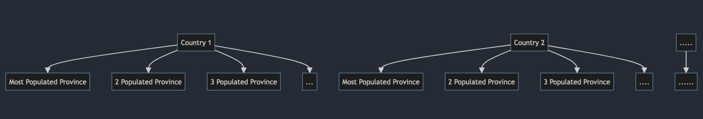
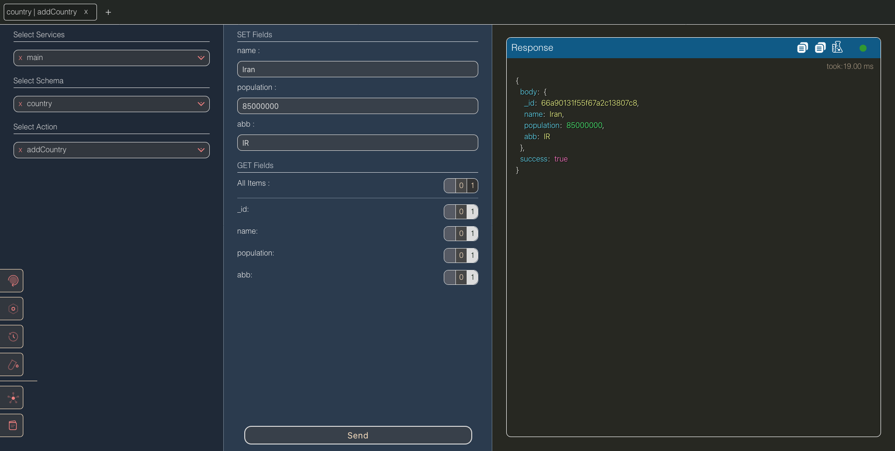
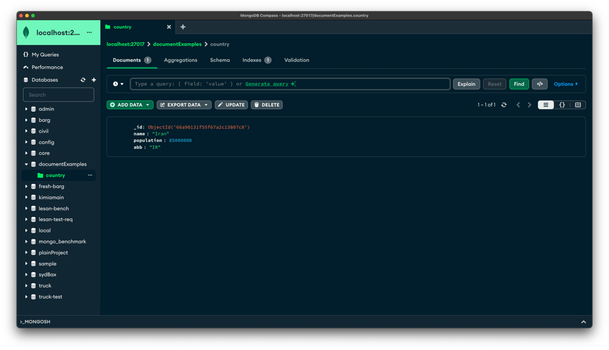
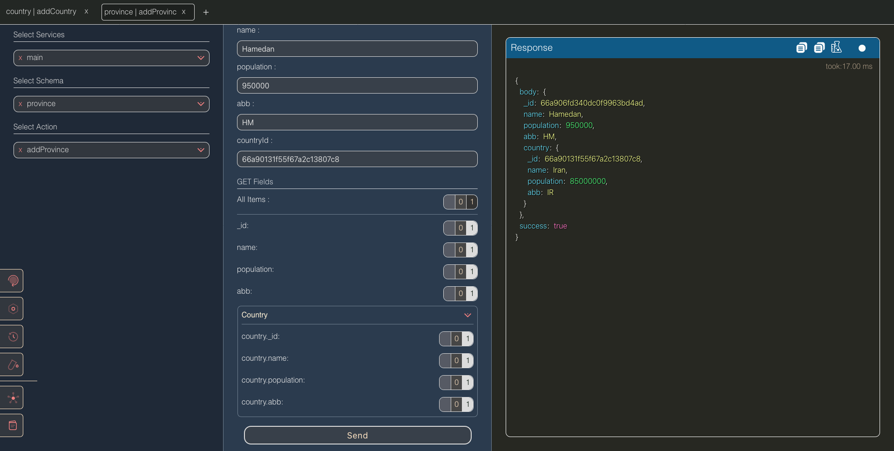

# Why Lesan: We Built a Framework That Turns O(n²) Queries Into O(log n)

*How one design decision — treating relationships as data that keeps itself in sync — makes Lesan return data hundreds of times faster than the stacks most of us use today.*

**By the Lesan team** · [GitHub](https://github.com/MiaadTeam/lesan) · [Docs](https://miaadteam.github.io/lesan/)

---

## 1. The problem: a "simple" request that kills your API

Imagine you run an application where users, provinces, and cities all belong to a country. Now the frontend asks for one screen:

> *"Give me all 250 countries, and for each one: the 50 most recent users, the 50 oldest users, the 50 most populous provinces, and for each province the 50 most recent and 50 oldest users — and the same for the 50 most populous cities."*

That's not an exotic request. It's a dashboard. A map view. An admin panel. And yet, in the most popular stacks on earth, this single screen is a performance disaster.

Let's count what has to happen:

| Level | What you fetch | Documents |
|---|---|---|
| 1 | 250 countries, by population | 250 |
| 2 | 50 recent + 50 oldest users per country | 250 × 2 × 50 |
| 3 | 50 populous provinces per country | 250 × 50 |
| 4 | 50 recent + 50 oldest users per province | 250 × 50 × 2 × 50 |
| 5 | 50 populous cities per country | 250 × 50 |
| 6 | 50 recent + 50 oldest users per city | 250 × 50 × 2 × 50 |
| | **Total** | **≈ 2,550,250 documents** |

Two and a half *million* documents — collected, joined, sorted, and assembled — just to paint one screen. And if your backend is doing this in a nested loop of ORM queries, you're not only paying for the database work; you're paying for **2.5 million network round-trips** between your server and your database.

Now here's the uncomfortable question nobody in the "just use Prisma/Mongoose" world asks: **why do we accept this as normal?**

## 2. What is Lesan?

Lesan is a cross-platform **TypeScript web framework + ODM** for MongoDB that runs on Node.js, Bun, and Deno from a single codebase. It gives you:

- **Models** — pure fields + relations, validated with `superstruct` at runtime.
- **Acts** — your API endpoints, defined with per-act validators (`set` for input, `get` for output).
- **Client-driven projections** — like GraphQL, the *client* chooses which fields (and how deep) it wants back, with no query language, no schema introspection server, and no backend refactoring when the frontend needs more.
- **Embedded, self-syncing relationships** — the part this article is about.
- **A request pipeline** (`POST /lesan`) that validates the model → act → input, runs optional auth hooks, executes the act, and applies the projection — all over a single endpoint.

The same `lesan()` factory, the same models, the same acts, run unmodified on Node.js, Bun, or Deno. There's no build step to install a runtime-specific backend: the framework is a thin layer over the official MongoDB driver plus the platform's native HTTP.

Lesan is open source: [github.com/MiaadTeam/lesan](https://github.com/MiaadTeam/lesan). It's also used in production by real applications (including [ZiWound](https://ziwound.com/en), a war-crimes documentation platform with 13 models and 98 acts).

But let's get to the heart of it.

## 3. The core idea: relationships as self-maintaining data

Every modern web framework treats relationships as something you *compute* at read time. You store foreign keys; when a client asks for a country with its provinces, the framework joins — in SQL with `JOIN`s, in MongoDB with `$lookup` or a nested `find` loop.

Lesan flips this. **Relationships are one-directional in definition, but embedded bi-directionally in storage — and Lesan keeps the embedded copies in sync for you.**

Concretely: when you define a `province` that belongs to a `country`, Lesan automatically embeds a snapshot of that province *inside the country document*, and a snapshot of the country *inside the province document*. When a province is inserted, updated, or deleted, Lesan updates every embedded copy automatically. You, the backend developer, write **zero** sync code.

Let's see what that looks like. This is the complete model definition from the article's [companion example](https://github.com/MiaadTeam/lesan/tree/main/examples/whyLesan):

```typescript
const pure = {
  name: string(),
  population: number(),
  abb: string(),
};

const countryRelations = {};
const countries = coreApp.odm.newModel(
  "country",
  pure,
  countryRelations,
);

const provinceRelations = {
  country: {
    optional: false,
    schemaName: "country",
    type: "single",
    relatedRelations: {
      provinces: {
        type: "multiple",
        limit: 50,
        sort: { field: "_id", order: "desc" },
      },
      provincesByPopulation: {
        type: "multiple",
        limit: 50,
        sort: { field: "population", order: "desc" },
      },
    },
  },
};

const provinces = coreApp.odm.newModel(
  "province",
  pure,
  provinceRelations,
);
```

Read the `relatedRelations` block like a contract: *"when a province points at a country, that country gains two fields — `provinces`, the 50 newest provinces, and `provincesByPopulation`, the 50 most populous provinces."*

Two embedded, pre-sorted, limited arrays. Kept in sync by Lesan. **Two different orderings of the same data, stored and maintained for free.**



### Why two arrays?

Because in a real app you need *both* orderings. The recent-items list (dashboard) and the by-population list (map). In a classic setup you'd write two queries per country. Here, both arrays already live inside the country document, already sorted, already limited — so reading them is a single document fetch with zero sorting at read time.

### What's actually stored, and what isn't

Two details matter here, and both are easy to miss:

1. **The back-reference arrays are stored on the *target*, not the source.** `provinces` and `provincesByPopulation` live inside the *country* document. The province document itself only stores a `country` snapshot. Lesan builds this from a single declaration — the province says "I belong to a country," and Lesan derives the reverse side automatically. This is the opposite of how most ODMs work, where you'd hand-maintain `country.provinces` yourself.

2. **Each embedded entry is a pure projection, not a full document.** Lesan embeds only the *pure* fields of the province (plus the relation's declared `excludes`). You decide what a province snapshot carries when you define the model. That's what keeps a `provinces` array of 50 small, and what keeps the country document far below MongoDB's 16 MB limit even as it accumulates several such arrays.

Because the embedded copies are pure projections, the system also has a bounded, predictable cost model: `limit` caps array length, `excludes` caps entry size, and the number of back-references is fixed at model-definition time. No hidden growth, no surprise bloat.

### The "one step less depth" principle

Lesan's read path has a simple rule: **for each request, penetrate one level less than a naive traversal would.** In a classic stack, fetching countries → provinces → cities → users means at *each* level you issue a query against the child collection. With embedded snapshots, the children are already inside the parent document — so the deep query that would touch three collections instead reads one collection (the countries) and lets the projection engine resolve the embedded levels that are already present. The result is that a relationship *that used to require a round-trip now costs nothing at read time* — it was paid for, once, at write time.

## 4. The magic, in code: insert a province, and everything updates

Now the *writes*. Adding a country needs no relation code at all:

```typescript
const addCountryValidator = () => {
  return object({
    set: object(pure),
    get: coreApp.schemas.selectStruct("country", 1),
  });
};

const addCountry: ActFn = async (body) => {
  const { name, population, abb } = body.details.set;
  return await countries.insertOne({
    doc: { name, population, abb },
    projection: body.details.get,
  });
};

coreApp.acts.setAct({
  schema: "country",
  actName: "addCountry",
  validator: addCountryValidator(),
  fn: addCountry,
});
```



Adding a province takes the country's `_id` and — that's it:

```typescript
const addProvinceValidator = () => {
  return object({
    set: object({ ...pure, countryId: objectIdValidation }),
    get: coreApp.schemas.selectStruct("province", 1),
  });
};

const addProvince: ActFn = async (body) => {
  const { name, population, abb, countryId } = body.details.set;
  return await provinces.insertOne({
    doc: { name, population, abb },
    relations: {
      country: {
        _ids: new ObjectId(countryId),
        relatedRelations: {
          provinces: true,
          provincesByPopulation: true,
        },
      },
    },
    projection: body.details.get,
  });
};

coreApp.acts.setAct({
  schema: "province",
  actName: "addProvince",
  validator: addProvinceValidator(),
  fn: addProvince,
});
```

That's the *entire* relation-handling code for inserting a province: declare the target, declare which `relatedRelations` to refresh, done. Lesan:

1. Inserts the province document.
2. Embeds a province snapshot inside the country's `provinces` array (positioned by `_id` sort).
3. Embeds a province snapshot inside the country's `provincesByPopulation` array (positioned by `population` sort).
4. Embeds a country snapshot inside the province (the forward side).
5. Evicts the 51st-oldest entries to respect each `limit: 50`.

**The same thing happens on `update` and `delete` — automatically, with zero extra code.** If the province's population changes, Lesan re-sorts `provincesByPopulation`. If the province is deleted, both arrays are repaired. No `arrayFilters`, no `updateMany`, no sagas, no sync jobs.



The embedded snapshots are also **pure projections** (just the fields you care about, trimmed via `excludes`) — so a 50-item array of full provinces never bloat a country document past MongoDB's 16 MB ceiling.

## 5. The numbers: O(n²) becomes O(log n)

Here's the payoff. Revisit the million-document request from section 1 — now against Lesan:

- The 250 countries are **250 documents** — one query.
- Each country document *already contains* its 50 recent users, 50 oldest users, 50 populous provinces, 50 populous cities — **embedded and pre-sorted**.

So fetching the whole tree is **just the 250 country documents**.

| Stack | Documents fetched |
|---|---|
| PostgreSQL (nested queries / ORM) | ~2,550,250 |
| MongoDB (nested `find` loop) | ~2,550,250 |
| MongoDB (`$lookup` pipelines) | ~2,550,250 (one pipeline, but still massive join work) |
| **Lesan** | **25,250** |

Wait — why 25,250 and not 250? Because at `selectStruct("country", 2)` depth 2, you ask for countries → provinces/cities → users. The users embedded *inside* provinces/cities are fetched by Lesan's projection engine at that deeper level. Still — 25,250 documents instead of 2,550,250 is a **~100× reduction**, and those 25,250 come back in a handful of database round-trips instead of thousands.

In complexity terms: a naive N+1-style traversal is `O(n²)` (actually `O(n^depth)` — with three levels of nesting, it's `n^3`). Lesan's embedded model reduces the *collection* work to `O(log n)` — the embedded arrays are just fields of a document you already fetched. More importantly, it removes the **2.5 million network round-trips** between server and database, which is where most of your latency actually lives.

Let me be careful about what `O(log n)` means here, because a reviewer will (rightly) poke at it. The claim isn't that MongoDB has magical indexing on embedded arrays. The claim is about *your code's* data-collection cost: the number of documents your application must fetch and assemble to answer a deep request. In a nested-query stack that number grows with the *product* of the depth and the fan-out (`n × m × k`). In Lesan, the deep levels are already inside the documents you fetch at the top level — so the *application-level* cost of that same request is dominated by the top-level documents, which scales as `O(log n)` (a handful of index hits). MongoDB's index on `_id` (and on any `createIndex` you declare) is what makes each of those lookups logarithmic.

### Where the "25,250" comes from

In the example above I set `selectStruct("country", 2)` — depth 2 — which means: countries at the top level, provinces/cities at depth 1 (already embedded in the country documents), and their users at depth 2 (already embedded in the province/city snapshots). Because every level below the top is embedded, the only *collection* query is for the 250 country documents; the users inside provinces and cities are resolved from the already-fetched snapshots by the projection engine. So:

- **250 country documents** — one indexed query.
- **25,000 users** — already inside those 250 documents as embedded snapshots.

Total application-level work: **25,250 documents**. Same screen, same data, ~100× less fetching.

And here's the part that matters even more than the document count: the classic stack doesn't just fetch 2.5M documents — it fetches them as **2.5M sequential round-trips** in an N+1 loop (or one giant pipeline that materializes all of them in memory). The dominant cost in real systems is usually that per-query overhead and the wire time, not the documents themselves. Lesan collapses 2.5M round-trips into one query.

Let's make this concrete with the *read* act:

```typescript
const getCountriesValidator = () => {
  return object({
    set: object({}),
    get: coreApp.schemas.selectStruct("country", 2),
  });
};

const getCountries: ActFn = async (body) => {
  const { set, get } = body.details;
  return await countries
    .aggregation({ pipeline: [], projection: get })
    .toArray();
};

coreApp.acts.setAct({
  schema: "country",
  actName: "getCountries",
  validator: getCountriesValidator(),
  fn: getCountries,
});
```

The backend act is *tiny* — because the client decides what to fetch. A single POST carries the projection tree:

```json
POST http://localhost:7500/lesan
{
  "service": "main",
  "model": "country",
  "act": "getCountries",
  "details": {
    "set": { "page": 1, "limit": 250 },
    "get": {
      "_id": 1,
      "name": 1,
      "population": 1,
      "provincesByPopulation": {
        "_id": 1, "name": 1, "population": 1,
        "users": { "_id": 1, "name": 1, "family": 1, "age": 1 },
        "usersByAge": { "_id": 1, "name": 1, "family": 1, "age": 1 }
      }
    }
  }
}
```

The client asks, Lesan answers. No new endpoint, no backend refactor, no GraphQL schema to maintain.

## 6. What you no longer have to write

The draft of this article contained a very long section on what manual embedding costs. Let me show you *why* Lesan exists, by showing you the alternative.

If you embed data yourself, you must keep it in sync **by hand**. Here is a *minimal* version of updating one user across the nested arrays of just two collections — using MongoDB's `updateMany` with `arrayFilters`:

```javascript
// WITHOUT Lesan: update one user across every place they're embedded
await db.collection('countries').updateMany(
  { "recentUsers.userId": userId },
  { $set: { "recentUsers.$[elem]": updatedUserData } },
  { arrayFilters: [{ "elem.userId": userId }] }
);

await db.collection('countries').updateMany(
  { "oldestUsers.userId": userId },
  { $set: { "oldestUsers.$[elem]": updatedUserData } },
  { arrayFilters: [{ "elem.userId": userId }] }
);

await db.collection('countries').updateMany(
  { "provinces.recentUsers.userId": userId },
  { $set: { "provinces.$[].recentUsers.$[elem]": updatedUserData } },
  { arrayFilters: [{ "elem.userId": userId }] }
);

await db.collection('countries').updateMany(
  { "provinces.oldestUsers.userId": userId },
  { $set: { "provinces.$[].oldestUsers.$[elem]": updatedUserData } },
  { arrayFilters: [{ "elem.userId": userId }] }
);
```

Now multiply that by: cities, the forward-side snapshots, the second (by-population) ordering, deletes, and the subtle bugs where a user moves between provinces and their old snapshot lingers. This is exactly the class of bug that produces **stale data in production** — and it's why most teams simply give up on embedding and go back to joins.

### Why the manual approach always breaks

Three structural problems doom hand-rolled embedding at scale:

1. **The update fan-out is unbounded.** Every write must find *every* document that could contain a snapshot — which is every document in every collection that ever referenced this entity. You can't `$set` your way out of a 50-item sorted array that needs re-sorting; you have to *remove* the stale entry and *re-insert* the updated one in the right position, for every ordering you maintain, across every referencing document.

2. **Delete is the worst case.** Removing a province means walking every country, every ordering, and any parent that transitively embedded it. Miss one spot and you've shipped a phantom record to your users.

3. **Consistency is eventual — at best.** There's no transaction across your N `updateMany` calls. A crash mid-way leaves your data in a half-updated state with no reconciliation job.

Lesan removes this entire class of code and these failure modes. Update the user document once; every embedded copy is re-projected automatically. The [update/delete sync engine](https://github.com/MiaadTeam/lesan) handles forward + reverse propagation, sort-window maintenance, and limit eviction — tested, not trusted.

## 7. The real benchmarks

The query-count argument is architectural. But we also ran actual head-to-head benchmarks against real stacks, and the results back up the claim. You can reproduce everything in the [MiaadTeam/benchmark](https://github.com/MiaadTeam/benchmark) repo.

### Client response time — vs the same request on other stacks

| Stack | Lesan is faster by |
|---|---|
| vs `prisma-express-rest` (PostgreSQL) | **1,168%** |
| vs `prisma-express-graphql` (PostgreSQL) | **1,417%** |
| vs `mongoose-express-rest` (unsorted) | **4,435%** |
| vs `mongo-express-rest` (unsorted) | **72,289%** |
| vs `mongoose-express-rest` (with sort) | **298,971%** |

Formula: `(B − A) ÷ A × 100`. The chart lives in the repo: [chart.svg](https://github.com/MiaadTeam/lesan/blob/main/chart.svg).

> **Honesty note:** these are relative numbers. `298,971%` sounds absurd because the baseline (`mongoose-express-rest` with a sort over a nested traversal) is *catastrophically* slow — that's the point. The absolute takeaway is the same: nested-query stacks pay for the same data many times over, and Lesan pays once.

### HTTP throughput — Lesan's own server

Lesan's server handles over **10,000 requests/second** on Bun and Deno, with sub-10 ms latency — because it's just the platform's native HTTP on top of the official MongoDB driver. (Full cross-runtime numbers in the [benchmarks doc](https://miaadteam.github.io/lesan/docs/benchmarks).)

## 8. Tradeoffs: when NOT to use Lesan

No engineering decision is free, and the HN/Reddit crowd will (correctly) push on this. Here's the honest version.

**Embedding trades write cost for read cost.** Every insert/update/delete that touches a relationship touches the embedded copies too. For write-heavy workloads where the reads don't need the depth, this is extra work. Lesan mitigates it with `limit`, `excludes`, and pure projections — but it's a real consideration.

**Duplication is real.** The same province appears in `provinces`, `provincesByPopulation`, and its own collection. That's storage overhead — but each embedded copy is a *pure projection* (a trimmed snapshot), not a full document. In practice the duplication is a small fraction of total size, and it's the price of O(log n) reads.

**The 16 MB document ceiling.** MongoDB documents cap at 16 MB. Lesan's `limit` on every back-reference is exactly what keeps a country from accumulating 100,000 embedded provinces. Design your `limit`/`excludes` and you never approach the ceiling.

**High-cardinality reverse lists.** If one document legitimately needs *all* 100,000 children embedded, embedding is the wrong tool — keep the back-reference limited and query the child collection with an index instead.

**When embedding is overkill.** If your relations are shallow and your reads are simple single-document fetches, Lesan still works perfectly — it just won't be the dramatic win. The win is proportional to *relationship depth*.

**The maintenance cost of the sync engine itself.** Every relationship operation runs Lesan's relation pipeline (forward + reverse projection, sort windows, limit eviction). For most workloads this is negligible next to the read savings — but it's real. Lesan's answer is to keep the pipeline small, index-driven, and to let you tune `limit`/`excludes` so each sync touches as little data as possible.

### When is Lesan the right choice?

In practice the profile that wins is: **deep, read-heavy relationship graphs with bounded fan-out per node** — exactly the shape of dashboards, content trees, map views, org charts, catalogs, and social feeds. If you're building one of those, the tradeoff is heavily in Lesan's favor: you trade a little extra write work and storage for reads that are an order of magnitude cheaper to fetch and, more importantly, an order of magnitude fewer round-trips.

If your workload is write-heavy with shallow reads — a write-only event logger, a pure time-series ingest — embedding buys you little, and Lesan won't be dramatically faster than anything else. It still runs correctly and cross-platform; it just won't be the story of this article.

## 9. Run it yourself

Everything in this article runs on your machine in minutes. The full example lives in the repo at [`examples/whyLesan/performance.ts`](https://github.com/MiaadTeam/lesan/tree/main/examples/whyLesan) — all four models, the embedded relations, and the acts, exactly as written above.

```bash
# requires MongoDB + Deno (or Node/Bun)
deno run -A examples/whyLesan/performance.ts
```

Then open the Lesan **Playground**, add a country, add a province with a `countryId`, and inspect the country document in Mongo Compass — you'll see `provinces` and `provincesByPopulation`, both already sorted and limited. Then call `getCountries` with the projection above and watch the whole tree come back in one shot.



## 10. Conclusion

The database industry spent decades optimizing *queries*. Lesan's bet is different: **if the data you need is already embedded, sorted, and in the document, the query barely has to exist.**

- Relationships are **one-directional in definition**, **embedded bi-directionally in storage**, and **self-syncing**.
- Reads drop from ~2.5 million documents to ~25 thousand for the same screen — from `O(n²)`-style nested traversals to `O(log n)`.
- You stop writing `updateMany` + `arrayFilters` sync code, and you stop shipping stale-data bugs.
- It's **cross-platform** (Node.js / Bun / Deno), **GraphQL-like** (client-driven projections), and **open source**.

We built Lesan because we were tired of watching dashboards do 2.5 million queries to paint one screen. If that pain sounds familiar — try it, benchmark it against your own stack, and [open an issue](https://github.com/MiaadTeam/lesan/issues) if you think we're wrong. We'd love to be proven right.

---

**Resources**

- Lesan on GitHub: [github.com/MiaadTeam/lesan](https://github.com/MiaadTeam/lesan)
- Docs: [miaadteam.github.io/lesan](https://miaadteam.github.io/lesan/)
- Benchmark repo (reproduce everything): [github.com/MiaadTeam/benchmark](https://github.com/MiaadTeam/benchmark)
- Companion example: [`examples/whyLesan`](https://github.com/MiaadTeam/lesan/tree/main/examples/whyLesan)
- [Intro video (Farsi)](https://youtu.be/FzMNIGanXSQ)
- License: AGPL-3.0