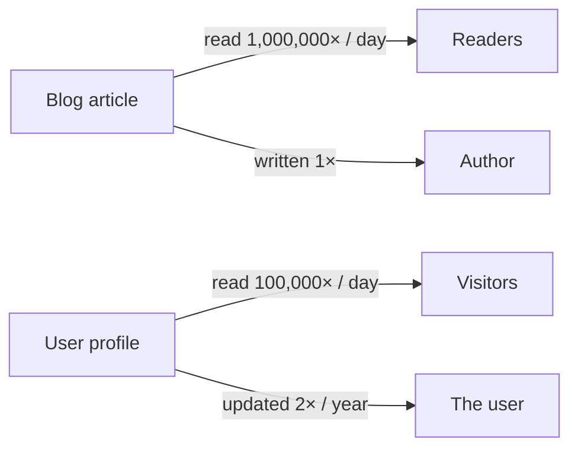
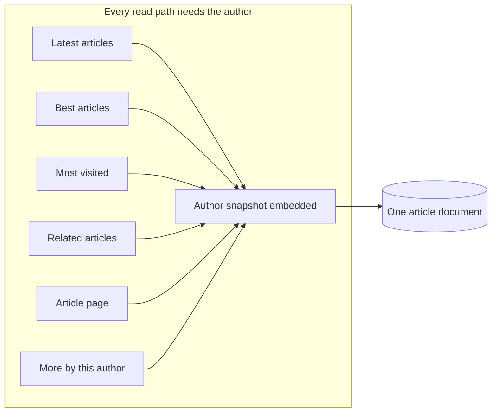
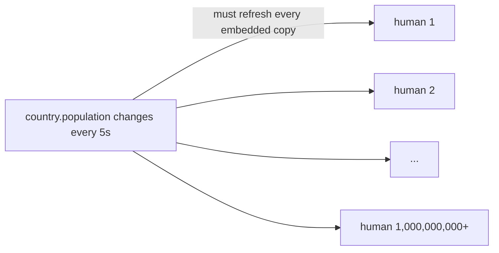
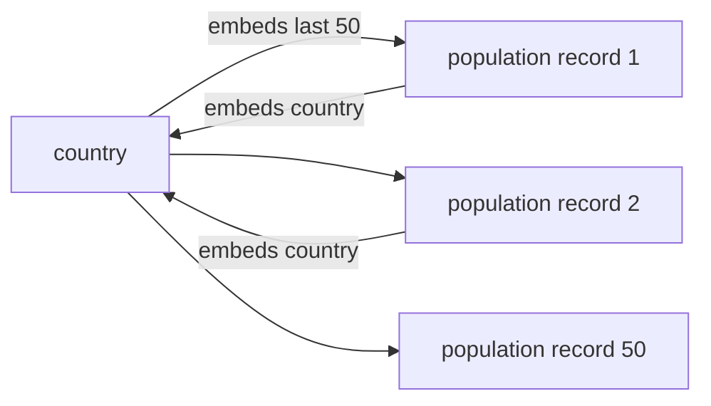

# The Nature of Data

> **TL;DR** — Real-world data follows a universal law: **expensive updates and deletions are rare, and cheap ones are frequent.** Lesan's embedded, self-syncing relationships turn that asymmetry into the win you saw in [Why Lesan](/docs/advantages/why-lesan). This page walks the two archetypal real-world cases — the best case (a blog) and the worst case (population statistics) — and shows how the *nature* of your data models decides everything.

## The law of data

Think about any popular application you use:

- A blog article is **read** thousands of times a day, but **written** once.
- A social post is **viewed** millions of times, but **created** once.
- A user updates their profile **once or twice a year**, but their content is **read hundreds of thousands of times a day**.

This is the asymmetry that most frameworks ignore: **reads dominate writes by orders of magnitude — and the writes that are expensive to maintain are exactly the ones that happen least often.**



In [Why Lesan](/docs/advantages/why-lesan) we showed the mechanism: embedding relationships turns a ~2,550,250-document read into a ~25,250-document read. The question this page answers is different: *isn't that cheating? Doesn't maintaining all those embedded copies cost you on every write?*

The answer, from real projects: **no — because of the nature of data.** The writes you're paying for are rare, and the reads you're saving are constant. Let's prove it with two real-world archetypes.

## The best case: a blog

Suppose we build a blog. The obvious models: `user`, `category`, `tag`, and `article`. Let's look at just `user` and `article` — the heart of the system.

With Lesan we declare the relationship once, on the side that needs it, and embed both ways:

```typescript
const articleRelations = {
  author: {
    schemaName: "user",
    type: "single",
    relatedRelations: {
      articles: {
        type: "multiple",
        limit: 50,
        sort: { field: "_id", order: "desc" },
      },
    },
  },
};
```

The effect: an article embeds its **author** (a pure snapshot of the user), and a user embeds their **50 most recent articles**. Both sides are kept in sync by Lesan on every insert, update, and delete.

### Reads: this is where the blog lives

A blog is a read machine. Almost every read path needs the author:

- the **latest articles** (feed) — need author
- the **best articles** (by score) — need author
- the **most visited articles** — need author
- **related articles** — need author
- the article page itself — needs author
- the **"more by this author"** strip at the bottom of an article (6–7 more articles) — needs author

All of these are served by the **same embedded snapshot**: the author's `_id` and pure info are already inside the article document. Lesan queries once, and the author (plus their 50 recent articles) is already there — sorted, limited, and correct. That's the O(log n) read from [Why Lesan](/docs/advantages/why-lesan): the author field was paid for once, at write time, and costs nothing at read time.



### Writes: the cost is tiny — because it's rare

Now the scary-sounding part: when an article is updated or deleted, Lesan has to keep both sides in sync. But count how many places an article lives:

1. the article document itself, and
2. the author's embedded `articles` array — and even that is bounded: the array holds only the **50 newest** articles, so Lesan touches it only when the changed article is actually inside that window. An article that has already fallen past the limit lives only in the `article` collection — there is nothing to sync.

That's **two places**. And how often does an article change? Once, when it's written — and maybe once more when it's edited. Meanwhile it's read **a million times**.

> **A million reads against two writes.**

The balance is absurdly good.

### The harder write: a user updates or deletes themselves

The genuinely expensive scenario: the **user** is updated or deleted. Now every article that embeds them must be refreshed — and that number could be large. But how large, really?

- A user who publishes **daily for a year** has at most **365 articles**.
- Updating or deleting the user means touching up to **365 embedded snapshots** — a bounded, knowable, one-time cost.
- Meanwhile those articles are read **hundreds of thousands of times a day**.

> **Millions of reads every day, against 365 writes once a year.**

That's not a compromise. That's a *deal*.

## The principle behind the best case

The blog works because of a pattern that repeats across almost every real data model:

- **Wherever an update or delete is expensive, its frequency is tiny.**
- **Wherever an operation is cheap, its frequency is enormous.**

This is the *nature of data models*. Reading is what people do all day; writing is what happens occasionally. Lesan's embedding is beautiful precisely because it was designed for this nature — it spends a little on the rare writes to save a lot on the constant reads.

## The worst case: population statistics

Now the nightmare scenario — because being honest about when embedding *seems* catastrophic is what makes this framework trustworthy.

Imagine an app storing population statistics: a `country` model and a `human` model.

- The country is embedded inside each human (so a human always knows their country).
- The last ~50 humans are embedded inside each country (for pagination; the rest are fetched from the `human` model on later pages).

That's the same pattern as the blog — and then disaster strikes. The country has a **`population` field**, and it changes every 5 seconds. To keep the world consistent, every human of that country would need their embedded country snapshot refreshed. India. China. **More than a billion updates every 5 seconds.**

This is the moment embedding looks like the worst idea in engineering history.



### Solution 1: exclude the volatile field

The first fix is trivial: tell Lesan not to embed `population` in the human documents.

```typescript
const humanRelations = {
  country: {
    schemaName: "country",
    type: "single",
    excludes: ["population"],   // don't copy this field into humans
    relatedRelations: { ... },
  },
};
```

Now updating `population` touches only the country document. Problem solved — hooray. But let's not stop there.

### Solution 2: let the nature of data guide you — have children

Go back to the *essence* of the models. What is `population`? It isn't a stable property like a country's `name` or `abb` — it's a **history**, a series of values over time. It *wants* to be its own entity.

So instead of a field, make it a **model**:

```typescript
const populationRelations = {
  country: {
    schemaName: "country",
    type: "single",
    relatedRelations: {
      populations: {
        type: "multiple",
        limit: 50,
        sort: { field: "recordedAt", order: "desc" },
      },
    },
  },
};
```

Now a country embeds its **last 50 population records**, and each record embeds its country. Both sides are stored together, synced automatically, and — crucially — the whole thing becomes *analytically rich*:



- every population record has its own timestamp,
- you can chart a country's population **history**,
- you can compute deltas, trends, and statistics from real data,
- and a human's embedded country snapshot can simply `exclude` the volatile data entirely.

Did you notice what happened? **The Lesan mechanism itself guided you to a better, more professional model.** Instead of a single country + a billion fragile embedded copies, you now have country + a tidy `population` model + humans — each with clean, bounded relationships.

Lesan encourages you to have **children**.

:::note
**This is exactly the principle in [What Is the Relationship Really?](/docs/concepts/what-is-the-relationship):** *"if a field changes often, promote it to a relationship."* A frequently-changing field is a sign that a new model wants to be born — and Lesan's relationship engine makes that birth cheap and safe.
:::

### The economics of the fix

After the promotion, what does a write cost?

- Insert a new population record: **one insert** into the `population` collection (plus the automatic embed into the country's last-50 array).
- No update to the country. No update to a billion humans.

In the worst case — compared to the naive design — you do **two operations instead of one** (the insert plus the embed). Against **millions of reads** for statistics and analytics, that is nothing.

## The general rule

Put the two archetypes together and you get a practical design law:

1. **Deep, read-heavy graphs** (blog, catalog, map, feed, org chart) — embed the relations and enjoy O(log n) reads; the rare writes are cheap to maintain.
2. **Volatile fields** (population, price, stock, status) — don't embed them into a billion documents. Either `exclude` them from the snapshot, or **promote them into their own model** and let Lesan maintain the relationship.
3. **Wherever writes are expensive, they are rare.** Design for the reads — they are what your users actually do.

## The takeaway

In [Why Lesan](/docs/advantages/why-lesan) we showed that Lesan turns a ~2,550,250-document read into a ~25,250-document read. The obvious objection is "but what about the writes?" This page is the answer:

- In a blog, writes are **two places per article** against **a million reads**.
- Even the worst case — updating a user who published every day for a year — is **365 writes once a year** against **millions of reads every day**.
- And the truly volatile fields (population updated every 5 seconds) aren't embedding problems at all — they're a sign that a **new model should be born**, and Lesan makes that birth elegant.

Lesan isn't fast because it's clever. **It's fast because it understood the nature of data first.**

## Related

- [Why Lesan](/docs/advantages/why-lesan) — the mechanism and benchmarks
- [What Is the Relationship Really?](/docs/concepts/what-is-the-relationship) — the philosophy of relationships
- [Why NoSQL?](/docs/concepts/why-nosql) — why MongoDB
- [Benchmarks](/docs/benchmarks) — the numbers